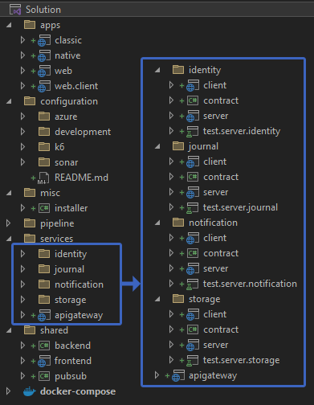
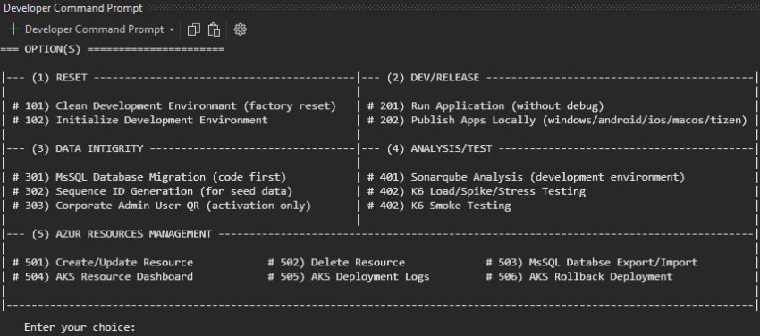
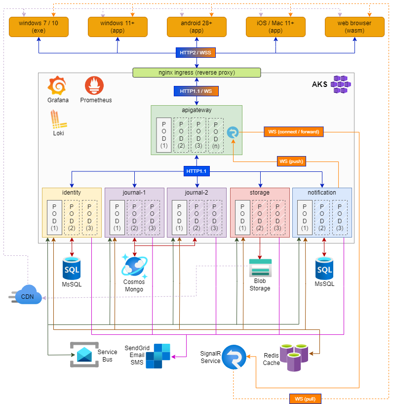
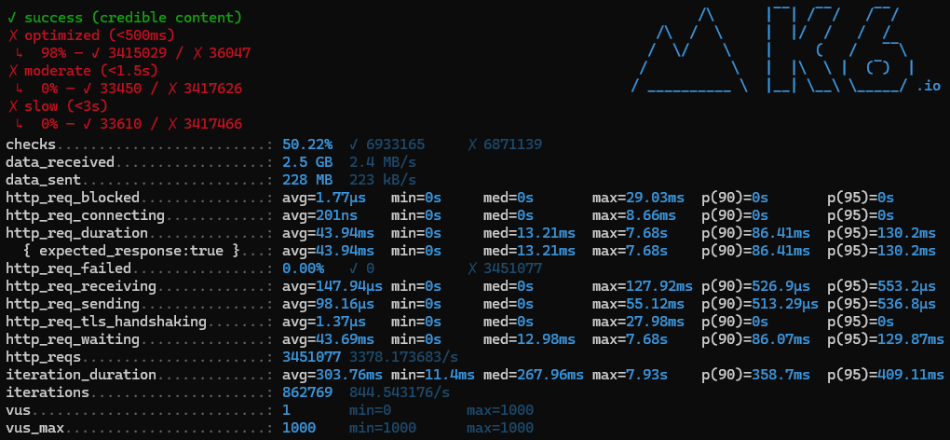
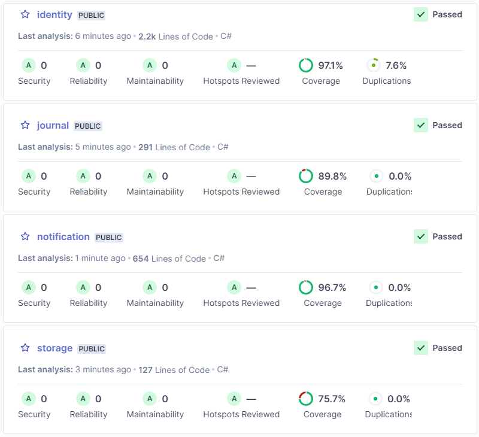
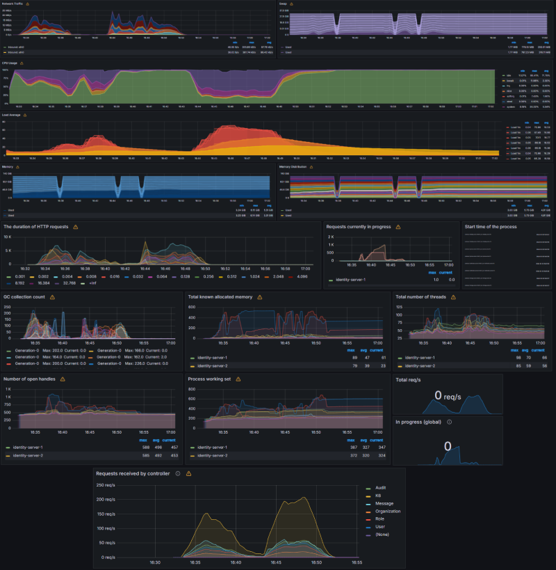
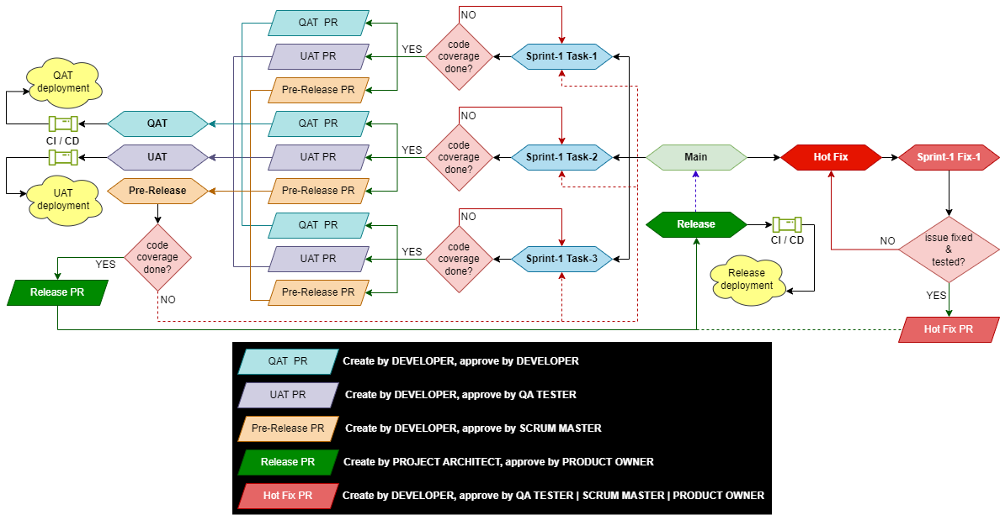

  
[&mdash; The Invincible Solution. &mdash;] 

**V3** is a highly scalable microservice based generic architecture designed for the optimal output, easy to use, rapid development.  
**Backend** &rArr; Dotnet Core WebApi (Onion architecture with TDD)  
**Frontend** &rArr; Blazor web (WebAssembly) + Winform + MAUI (Vertical slice architecture)  
**Framework** &rArr; .NET8 (C#)  
**Database** &rArr; MsSQL, Redis, Mongo (azure cosmos)  
**Messaging** &rArr; RabbitMQ / Azure Service Bus  
**Platform** &rArr; Docker / Kubernetes

# Development Prerequisite
**Hardware Requirement**
1.  8 core/16 thread processor or higher (high TDP cpu is better)
2.  32 GB of RAM (3200 mhz) or higher
3.  30 GB of disk space (M.2 ssd) or higher
4.  Full HD display or higher
5.  Dedicated graphics (optional)

**Software Requirement**
1.  Windows 11 or higher with PowerShell updates
2.	Visual Stodio 2022 or higher (with latest updates) [(download)](https://visualstudio.microsoft.com/vs/)
3.  Windows subsystem for linux (configure from windows features) [(download)](https://wslstorestorage.blob.core.windows.net/wslblob/wsl_update_x64.msi)
4.	Docker Desktop [(download)](https://www.docker.com/products/docker-desktop/)
5.	Sql Server Management Studio [(download)](https://learn.microsoft.com/en-us/sql/ssms/download-sql-server-management-studio-ssms?view=sql-server-ver16)
6.	Redis Desktop Manager [(download)](https://redis-desktop-manager.software.informer.com/download/)
7.  MongoDb Compass [(download)](https://www.mongodb.com/try/download/compass)
8.  Azure CLI [(download)](https://azcliprod.blob.core.windows.net/msi/azure-cli-2.29.0.msi)
9.  #1JDK (optional) [(download)](https://www.oracle.com/in/java/technologies/downloads/#jdk22-windows) ** validate JAVA_HOME environment variable after installation
10. #2Git for Windows (optional) [(download)](https://github.com/git-for-windows/git/releases/download/v2.41.0.windows.1/Git-2.41.0-64-bit.exe)  
#1 : Only required when sonarqube failed due to its dependencies.  #2 : Only required for local testing purpose where dev environment is not available.

# Solution Architecture
| Architecture | Description |
| ------------ | ------------ |
|  | Let's start with brief description of projects...  **classic** &rArr; Classic windows executable for legacy system (windows 7/8/10). **native** &rArr; Cross-platform native app for Android / Windows / iOS / MacOS / Tizen. **web &amp; web.client** &rArr; Webassembly enabled web application for the latest browsers. **installer** &rArr; Classic windows exe installer (console application). **identity &#8285; client** &rArr; Isolated micro-frontend service, contains UI/UX for organization/user/role/policy related operations. **identity &#8285; contract** &rArr; Frontend-backend communication data contracts &amp; validations. **identity &#8285; server** &rArr; Isolated backend api service for organization/user/role/policy related operations. **identity &#8285; test.server.identity** &rArr; Data validation &amp; business logic execution test cases. **journal &#8285; client** &rArr; Isolated micro-frontend service, contains UI/UX for log related operations. **journal &#8285; contract** &rArr; Frontend-backend communication data contracts &amp; validations. **journal &#8285; server** &rArr; Isolated backend api service for log related operations. **journal &#8285; test.server.journal** &rArr; Data validation &amp; business logic execution test cases. **notification &#8285; client** &rArr; Isolated micro-frontend service, contains UI/UX for push todo etc related operations. **notification &#8285; contract** &rArr; Frontend-backend communication data contracts &amp; validations. **notification &#8285; server** &rArr; Isolated backend api service for push todo related operations. **notification &#8285; test.server.notification** &rArr; Data validation &amp; business logic execution test cases. **storage &#8285; client** &rArr; Isolated micro-frontend service, contains UI/UX for file upload/download related operations. **storage &#8285; contract** &rArr; Frontend-backend communication data contracts &amp; validations. **storage &#8285; server** &rArr; Isolated backend api service for file upload/download related operations. **srorage &#8285; test.server.storage** &rArr; Data validation &amp; business logic execution test cases. **apigateway** &rArr; Request entry point and route-redirection with load balancer including realtime bi-directional websocket connection using SignalR. **backend** &rArr; Core dependencies and shared functionalities for backend services. **frontend** &rArr; Core dependencies and common functionalities for frontend apps. **pubsub** &rArr; Inter-service communication data contract/messages. **docker-compose** &rArr; Docker image+container and runtime configuration for development environment including tests.  [*note: Each isolated micro-service contains four projects (client, server, contract, test). like Identity, Journal Notification and Storage are individual services*]   |

# Build Automation
  
These features are fully/partly automated during any phase of development to deployment

# Cloud-Environment &amp; High-level Dataflow Diagram

# Coding Guideline/Rules
*[Maintain following rules as coding guideline]*
1. Use proper naming convention. Don't use short form or abbreviation. Use verbs to naming method/function.
2. Don't trust end user. Do a zero-tolarence data validation before any data processed.
3. Don't write unnecessary/bad comments, instead write readable code. Use summary comments for public methods.
4. Don't write method/function with multiple parameter arguments (max 7). Use sealed record instead.
5. Don't pass boolean variable as method/function argument, instead write two separate methods.
6. Avoid magic numbers or hard-coded values. Use constant and separate them from the core business logic.
7. Use optional parameter with default value to avoid short-circuit result.
8. Don't write large code files (max 500 lines).
9. Never write a large method (max line should be 50).
10. Make sure generic base class method/function(s) should be virtual, that can be easily override when required.
11. Avoid nested conditions and looping to reduce cyclometric complexity.
12. Split business logic into multiple methods where each method performs only one task.
13. Isolate actual business logic using interface, but don't do unnecessary loose-coupling with multiple layers.
14. Always use sealed class if there is no inheritance.
15. Implement IDisposable where possible.
16. Never use Thread operations unless it is very much required.
17. Avoid excessive allocation to redurce the GC overhead. Use record types for simple objects.
18. Always write proper test(s) for business logic (more test case = more accuracy).
19. Avoid unnecessary copying of memory/steam. Always dispose after complete the operation.
20. Avoid unnecessary LiNQ operations when possible.
21. Avoid dynamic collections until add/delete operation is required. Use array types instead.
22. Avoid unnecessary casting (boxing/unboxing).
23. Accept all warnings as error.
24. Be careful and conscious on threads and loops like when to use for, when foreach, when parallel tasks etc.
25. Declare variable at lowest scope when possible.
26. Always create/update a business-flow-chart when writting/modifying a code.
27. Create small reusable components.
28. Do a honest code review and pass test(s) before any Pull-Request or CI/CD or Deployment.
29. Do a code analysis/coverage  before any Pull-Request or CI/CD or Deployment.
30. If possible write benchmark-test and run profiler to confirm optimization of process.
31. *Always test all possible scenario in manual testing and document those with proper screen-shot (QAT only).*

# Load Testing
| K6 (load/spike/stress) [local environment : 16 core/22 thread cpu : 32Gb ram] | Result |
|-------------------------------------------------------------------------------|--------|
||**upto 1K virtual users  17 minutes of traffic hammering  3.4M+ requests processed  3.3K+ request/second ( average )  100% success response  3.4M+ (98.96%) optimized response ( &frac12;s or less )  30K+ (0.97%) moderate response ( 1&frac12;s or less )  30K+ (0.97%) slow response ( 3s or less )  ZERO failed response**|

# Sonarqube Analysis
 

# Monitoring (prometheus + grafana + aks-dashboard)

# Repository Branching

# Misc.
Azure VM Comparison [(here)](https://azureprice.net)  
Azure MsSQL workload (DTUs) [(here)](https://learn.microsoft.com/en-in/azure/azure-sql/database/service-tiers-dtu?view=azuresql)  
Azure pipeline parallelism request [(here)](https://aka.ms/azpipelines-parallelism-request)

  
  
**Let's start...**  
**Happy coding...**